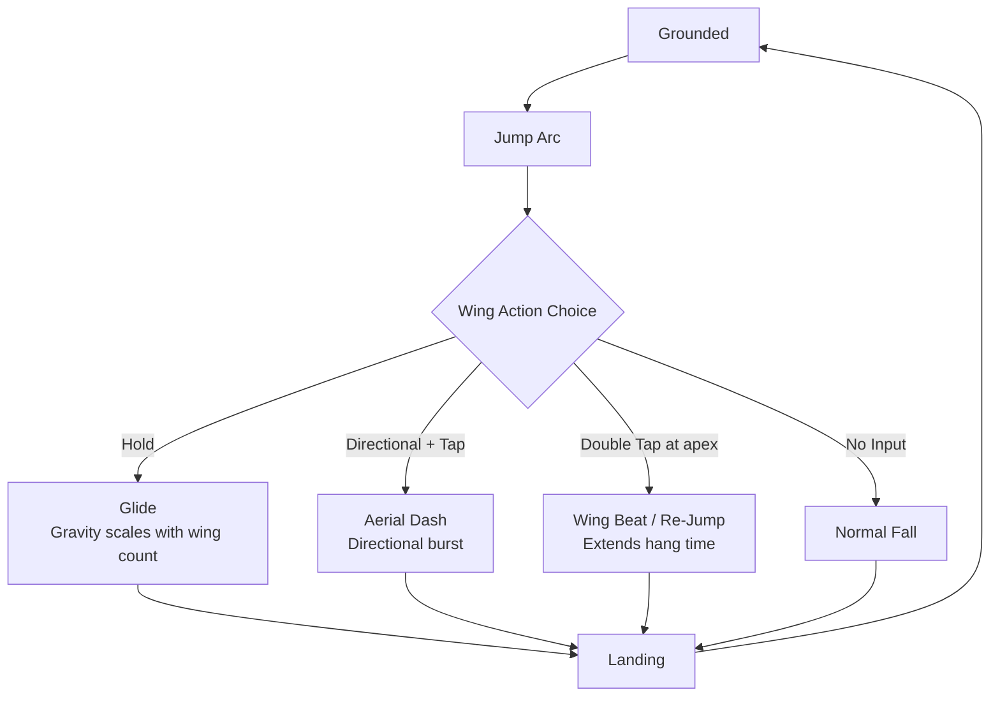

# Wing Extension 2.0
## 3D Action Prototype — Portfolio Documentation

> [!IMPORTANT]
> **Prototype Status:** This document describes a functional, scoped 3D game prototype. All assessments and claims are framed accordingly. The goal of this build was to validate a novel wing-based mechanic system — not to produce a shippable product.

---

### Project Context

| Field | Detail |
|---|---|
| **Project Type** | 3D Action Prototype (Unity URP) |
| **Team / Solo** | [TO FILL — *Solo project / Team of N? Please specify for portfolio accuracy.*] |
| **Development Timeline** | [TO FILL — *e.g., "Built over 8 weeks, Jan–Mar 2026." The "2.0" suffix implies at least one prior iteration — briefly noting what changed from 1.0 would add credibility.*] |
| **Build Status** | Functional prototype. Core mechanic validated. Production polish deferred by design. |
| **Video Demo** | [LINK PLACEHOLDER — *A 60–90 second gameplay video showing at minimum: glide, aerial dash, and wing-strike-to-recall is strongly recommended before sharing this document.*] |
| **Source Code** | [LINK PLACEHOLDER — *GitHub URL or "Available on request" if private.*] |

---

## Project Summary

Wing Extension 2.0 is a focused 3D action prototype built in Unity, designed to answer one specific design question: *can a set of detachable, repositionable wing objects serve simultaneously as a movement modifier, a platforming tool, a traversal grapple, and a melee/ranged combat instrument — without any of those roles feeling bolted on?*

Every technical decision in the codebase, and every design decision in the mechanic set, exists in service of that question. The prototype does not attempt to be a complete game. It is a proof of concept for a design hypothesis — that a small set of externalised, orbiting objects can become the single, unified vocabulary through which a player reads, moves through, and acts upon a 3D world. Systems deliberately deferred include: full animation integration, audio polish, enemy AI depth, and save/network state.

The prototype produces meaningful evidence that the hypothesis is viable at this scale. The wings function as movement modifier, aerial platform, combat weapon, and traversal grapple within a single, coherent interaction grammar that never requires the player to switch modes.

---

## Section 1 — Technical Analysis

> *Source: Agent 1 — Technical Analyst. This section covers engine architecture, character controller design, wing system implementation, combat integration, and technical rationale.*

### 1.1 Engine & Core Architecture

| Property | Detail |
|---|---|
| **Engine** | Unity (Universal Render Pipeline) |
| **Scripting** | C# |
| **Input** | Unity Input System (New) |
| **Animation** | DOTween (procedural, prototype phase) |
| **ECS** | Unity Entities (DOTS) — hybrid integration |
| **Version Control** | Plastic SCM, mirrored to GitHub |

**Project Layout:** Domain-centric under `Assets/_Project/`, subdivided into:
`Core` / `Gameplay` (`Player`, `Wings`, `Combat`, `Enemies`) / `Animation` / `UI`

**Core Patterns:**

| Pattern | Where Used | Purpose |
|---|---|---|
| State Machine (FSM) | Player locomotion, per-wing controller | Predictable, allocation-free per-frame execution |
| ScriptableObject data | `WingData`, `AttackData`, `CombatCombo` | Decoupled tuning — no subclassing required |
| Service Locator / Singleton | `CoreBootstrap` | Scene-level bootstrapper; lazy instantiation of `PoolManager`, `TimerManager` |
| Hybrid ECS | `WingRepulsor`, `WingAuthoring` | Future-proof path to Burst-compiled spatial queries |
| DOTween procedural animation | Wing swing, lunge, float | Designer-facing, no Animator export required at prototype scope |

`CoreBootstrap` creates `PoolManager` and `TimerManager` as deterministic children of a root `Core` GameObject, ensuring clean scene hierarchy and controlled initialization order.

---

### 1.2 Character Controller Implementation

The player controller is built on Unity's `CharacterController` component (not `Rigidbody`). This is a deliberate design argument: `CharacterController` provides deterministic, authorial movement and eliminates physics-solver imprecision during rapid iteration — a tradeoff that favours prototype velocity without sacrificing movement feel.

**`PlayerSystem`** owns the **`PlayerStateMachine`**, which drives 8 locomotion states:

| State | Role |
|---|---|
| `GroundedState` | Default on-ground locomotion |
| `AirborneState` | Standard airborne arc (no wing input) |
| `GlideState` | Gravity scales inversely with available wing count |
| `ChargeJumpState` | Held-jump charge, feeds into wing-burst potential |
| `DodgeState` | Directional evasion with invulnerability window |
| `OverboardGroundState` | Alternate ground locomotion (overboard mode) |
| `OverboardAirState` | Alternate airborne locomotion (overboard mode) |
| `TeleportState` | Instant repositioning (traversal grapple resolution) |

A `GravityMode` enum (`Default` / `Overboard` / `None`) is swapped on state entry, meaning every locomotion state is implicitly a wing-interaction surface — entering a state can change how gravity responds to wing count, wing presence, or wing action.

**`PredictionPlayerMovement`** runs a forward Euler trajectory simulation that feeds `WingPlatformState`, allowing a deployed wing to anticipate and position itself at the player's projected landing zone.

> 📷 **Image Suggestion:** Player state transition diagram — 8 nodes, annotated with transition conditions and the windows in which wing actions can be initiated or consumed.

---

### 1.3 Wing System — Technical Design

The wing system is the architectural centrepiece of the prototype. Each wing is an independent agent that belongs to a shared formation and an availability pool — simultaneously a resource and a physical object in the world.

**Formation Placement — Parametric Ellipse**

```csharp
// WingSystem.EllipsePointLocal
// Distributes N wings evenly across a parametric ellipse
// defined by WingData.ellipseRadiusX / ellipseRadiusZ
Vector3 EllipsePointLocal(int wingIndex, int totalWings, float radiusX, float radiusZ)
{
    float angle = (2 * Mathf.PI / totalWings) * wingIndex;
    return new Vector3(Mathf.Cos(angle) * radiusX, 0f, Mathf.Sin(angle) * radiusZ);
}
```

`WingData` ScriptableObject stores: wing count, ellipse radii, dead-zones. `WingSystem.RebuildWings()` is called in `FixedUpdate` on wing count change, keeping formation geometry in sync with available wing state.

**Per-Wing State Machine — 8 States:**

| Wing State | Behaviour |
|---|---|
| `WingFollowState` | Orbits player in formation |
| `WingGlideState` | Extends formation to modify player fall rate |
| `WingProjectileState` | Bezier-trajectory launch toward target |
| `WingReturnState` | Auto-recall to formation |
| `WingPlatformState` | Deploys ahead of player as traversal platform |
| `WingOverboardState` | Alternate locomotion surface (overboard mode) |
| `WingEnnemisHit` | Parented to hit enemy; delivers damage on recall |
| `WingCombatState` | Melee swing arc delivery |

**Float Animation:** Each wing carries a per-instance randomised `floatSeed` phase. `floatTimer` accumulates each frame and drives a sinusoidal idle oscillation, giving the formation organic, non-synchronized movement without an Animator.

**Availability Pool:**

```
_availableWings      → wings currently in formation, eligible for actions
_currentlyUsedWing   → wing committed to an active action
```

Auto-recall triggers at a `0.5s` interval when a deployed wing exceeds its distance threshold, preventing permanently lost wings and keeping the availability pool self-healing.

**Projectile Trajectory — Quadratic Bezier:**

```
P(t) = (1−t)²·Start + 2(1−t)t·Control + t²·End
```

- **Start:** Current wing position
- **End:** Raycast hit point, or max-distance fallback
- **Control:** Lateral + vertical offset, parameterised by wing index (wings curve differently depending on formation position)
- **Orientation:** Tangent evaluated per frame; `Slerp` rotation for smooth leading-edge look

The Bezier curve is not simply an aesthetic choice — a non-linear trajectory reads more intentionally to the player than a straight-line projectile, and the control-point parameterisation means each wing has a visually distinct arc even when launched simultaneously.

**Hybrid ECS Bridge:**

`WingAuthoring` creates a DOTS Entity per wing, carrying:
- `WingTag`
- `WingRepulsor` component
- Managed references to `Transform` and `WingController`

`WingTransformSyncSystem` runs inside `TransformSystemGroup` to synchronise the GameObject's world position with the ECS `LocalTransform`. This preserves full `MonoBehaviour` authoring while opening the path to Burst-compiled spatial queries in a future pass.

> 📷 **Image Suggestion:** Ellipse placement diagram with in-Editor gizmo screenshot showing wing distribution across the formation.

> 📷 **Image Suggestion:** Wing lifecycle data-flow diagram — `WingSystem` (spawn & formation) → `WingController` (per-wing FSM) → `WingAction` (pool management) → ECS sync layer.

---

### 1.4 Combat Integration

Combat is not a separate mode. `PlayerCombatSystem` drives the entire combat loop and consumes wings from the availability pool as its primary resource.

**Resource Gating:**

```
ConsumeWingsForCombat(2)  →  attack executes
_availableWings.Count < 2  →  attack suppressed
```

No wings available means no attack — the formation is the combat resource, visibly and mechanically.

**Combo System:**

- Combo index advances into a `CombatCombo` ScriptableObject's `List<AttackData>`
- 2-second window resets combo to 0 on inactivity
- Ground and air combo variants are selected based on `IsGrounded` at attack initiation

**`AttackData` ScriptableObject fields:**

| Field | Function |
|---|---|
| `hitbox` | `OverlapBox` shape and position |
| `lunge` | `DOMove` impulse (gap-closing) |
| `knockback` / `launch` / `slam` | Impulse vectors for enemy displacement |
| `playerGravityScale` | Overrides player gravity during attack |
| `enemyGravityReduction` | Reduces enemy gravity on hit (hang time) |
| `wing animation params` | Controls swing arc and timing |

**Wing Swing Animation (DOTween):**

`DOVirtual.Float` lerps the wing from start to end local position, with `swingCurve.Evaluate` driving a bow arc — giving the strike a physical sense of weight and follow-through without requiring a rigged animation export.

**Hit Resolution:**

`WingHitDetection.OnTriggerEnter` — on contact:
1. Wings are parented to the hit enemy (`WingEnnemisHit` state)
2. Immediate damage applied
3. Recall triggers → second damage tick on return (`pull damage`)
4. `RequestPull` fires a gap-closing impulse toward the player

**Environment Interaction:**

`WingSlot` is a puzzle-interactable that accepts wing insertion and removal, extending the wing resource model into level design without requiring additional mechanics.

> 📷 **Image Suggestion:** Side-by-side comparison — `WingPlatformState` (traversal role) vs. `WingEnnemisHit` (combat role) — demonstrating the same wing object serving two distinct gameplay functions.

---

### 1.5 Technical Decisions & Rationale

| Decision | Rationale | Tradeoff Accepted |
|---|---|---|
| `CharacterController` over `Rigidbody` | Deterministic, authorial movement; no physics solver imprecision | Manual gravity/collision handling |
| FSM consistency (`OnEnter/OnUpdate/OnExit`) | No per-frame allocation; same pattern across player and wings | Verbosity at small state counts |
| `ScriptableObject` data | Tuning fully decoupled from code; designers can iterate without recompile | No runtime inheritance |
| DOTween for animation | Designer-facing; no Animator export required at prototype scope | Less precision than blend-graph Animator |
| Quadratic Bezier trajectory | Non-linear arc reads more intentionally; trivially parameterisable per-wing | Slightly more expensive than linear lerp |
| Hybrid ECS | Opens Burst-compiled spatial query path without MonoBehaviour restructure | Authoring complexity; sync overhead |
| Two-pass aim assist | `Raycast` + `SphereCastAll` with line-of-sight filter | Additional raycast cost per frame |

---

### 1.6 Prototype Scope & Deferred Work

**Central design question validated by this build:**
> *Can detachable wing objects serve as movement modifier, platforming tool, traversal grapple, and melee/ranged combat instrument — within a single coherent interaction grammar?*

**Built and tested in this prototype:**
- Full 8-state player locomotion FSM
- Data-driven wing formation system (parametric ellipse, `WingData` SO)
- Per-wing 8-state FSM with availability pool and auto-recall
- Combo-driven combat with wings as hitbox delivery vehicle
- Bezier projectile trajectories with per-wing arc variation
- Trajectory prediction feeding platform anticipation
- Hybrid ECS architecture (DOTS bridge)

**Deliberately deferred (path understood, not abandoned):**
- Full Animator integration — `Rig[]` array and `PlayerAnimatorController` already referenced in code; the integration path is clear
- Audio and VFX polish
- Enemy AI depth and aerial counterplay
- Save state / network state

---

## Section 2 — Game Design Analysis

> *Source: Agent 2 — Game Design Analyst. This section covers design pillars, mechanic breakdown, combat design intent, player experience model, and prototype-as-design-tool assessment.*

### 2.1 Core Design Concept & Pillars

The central design question is not just mechanical — it is conceptual: *what happens when a character's identity is externalised as a dynamic physical system?*

Wings in this prototype are not a power-up or a mode. They are an extension of the player character that exists visibly in the world, communicates state to the player without UI, and serves as the medium through which every meaningful action — movement, traversal, and combat — is expressed.

Three design pillars structure the system:

| Pillar | Definition |
|---|---|
| **Kinetic Expression** | Movement is expressive, not utilitarian. How the player moves communicates intent and identity. |
| **Verticality as Agency** | Height and airtime are strategic resources to be earned, managed, and expended — not simply navigated. |
| **Combat as Movement** | No mode-switching. The vocabulary used to move through space is the same vocabulary used to act upon it. |

---

### 2.2 Base Movement & Jump

The standard humanoid controller functions as a contrast anchor. It is intentionally grounded and decisive, giving the wing system mechanical space to operate against. A predictable, physics-respecting jump establishes the gravitational expectation that wing actions then modify.

This is a deliberate design economy: a player who understands the base arc can immediately read what a glide or aerial dash is doing to that arc — the delta is legible because the baseline is clean.

---

### 2.3 Wing Mechanic — New Player Verbs

Wings introduce a set of new verbs layered onto the base locomotion:

| Verb | Input | Effect |
|---|---|---|
| **Glide** | Hold (airborne) | Sustained fall; gravity reduced proportional to wing count |
| **Aerial Dash** | Directional + Tap | Directional burst; consumes a wing action |
| **Hover / Stall** | Double-tap or contextual | Zero-gravity moment; maximum repositioning window |
| **Wing Beat / Re-Jump** | Double-tap (apex) | Mid-air reactivation; extends hang time |

Individual verbs are simple to understand. Their combinatorial potential — chaining glide into aerial dash into wing beat — is where skill expression lives. This is a deliberate skill floor / skill ceiling structure: accessible entry point, significant depth.

The externalised, floating wings also do communicative work: a player watching another player can read resource state from the formation without any UI. Wings deployed = resource spent. Wings in formation = options available.

**Wing Mechanic Flow:**



> 📷 **Image Suggestion:** Expanded wing mechanic flow diagram with input timings, momentum delta values, and risk/reward annotations per branch.

---

### 2.4 Combat Design — Grammar Extension, Not Branch

The combat system is the stress test of the "Combat as Movement" pillar. Wings never stop being wings. There is no weapon drawn, no mode entered — the same objects that carried the player through the air deliver the attack.

**Wing combat roles:**

| Role | Mechanism |
|---|---|
| **Reach / Range Extension** | Wings launched on Bezier arc; attack range decoupled from player position |
| **Directional Area Attack** | Formation swing; arc covers a lateral zone |
| **Momentum-to-Damage Transfer** | Aerial approach speed feeds lunge impulse on strike |
| **Pull-on-Recall** | Embedded wing drags enemy toward player on return |
| **Potential Defensive Use** | Parry / deflect (identified as future design space; not yet implemented) |

The mechanic of wings-as-hitbox demands careful animation authoring at production scale — the timing between wing launch, impact, and recall must feel precise, not floaty. At prototype scale, DOTween's `swingCurve` provides sufficient fidelity to test the concept. The question it answers is viability, not polish.

---

### 2.5 Player Experience — Composed Power

**Intended register:** *Composed power.* Not frenetic hack-and-slash. Not rigid precision platforming. The target feeling is deliberate and predatory — a player who is always slightly ahead of the situation, who acts from a position of read rather than reaction.

The player should feel *partnered with* the wing ability rather than wielding a tool. The formation orbits, floats, and responds to the player's state — it has presence and personality, not just function.

**Feedback Loops — Problem / Solution Framing:**

| Design Problem | Solution | Player Signal |
|---|---|---|
| How does the player know the wings are responsive? | Wing Activation: visual extension + immediate speed/lift shift | Physical sense of power on deployment |
| How does skill expression feel different from button-pressing? | Aerial Mastery: chained wing actions extend airtime progressively | Flow state — the ceiling rises with skill |
| How is aggression rewarded beyond basic damage? | Combat Impact: wing strike embeds → recall pulls enemy → second damage tick | Risk taken = gap closed + damage compounded |
| How does the game recover from resource expenditure? | Formation reconstitution on recall | Options re-open visibly; no opaque cooldown |

**Aim Assist Design Note:** The two-pass system (`Raycast` primary + `SphereCastAll` with line-of-sight filter) is calibrated to help the player express intent accurately in 3D space without removing the agency of aim. At prototype scale, this is a tuning scaffold — the parameters need playtesting against real input to set correctly.

> 📷 **Image Suggestion:** Split-screen of formation state at full availability (all wings orbiting) vs. post-combat formation (wings recalling from embedded positions) — showing the visible resource language.

---

### 2.6 Design Coherence — Single-System Pluralism

The prototype's structural ambition is **Single-System Pluralism**: one mechanic serving three distinct gameplay roles (movement, traversal, combat). This has concrete design advantages:

| Advantage | Explanation |
|---|---|
| **Teaching efficiency** | Learn one thing, gain access to everything. No separate tutorial for combat vs. movement. |
| **Design scalability** | New levels, enemies, or scenarios can be designed around a stable, known vocabulary. |
| **Tonal consistency** | The wings never "look wrong" in any context because they are always wings — always the same objects. |

**The main tension to manage** is the complexity ceiling: at what point do the wing's multiple roles create ambiguity rather than depth? When does the player reach for a wing action and feel uncertain whether they are platforming or attacking? This is the central design risk to address in next-iteration playtesting.

---

### 2.7 Prototype as Design Tool

**What this prototype demonstrates:**

1. The wing metaphor is mechanically generative — a single object type has produced four distinct gameplay systems without requiring a new mechanic for each
2. Externalising the ability creates a legible resource state — the formation is a spatial HUD
3. Movement and combat share a design language — the same input grammar applies to both contexts
4. 3D space is a prerequisite for this design, not an incidental setting — the ellipse formation, Bezier trajectories, and aerial states only function meaningfully with a full Z-axis

**Open Design Questions — With Current Hypotheses:**

| Question | Current Hypothesis | Next Experiment |
|---|---|---|
| **Wing resource model** (cooldown? stamina? charge?) | A count-based model (wings as discrete objects) is more legible than a stamina bar — the formation itself communicates resource state | Playtest count-based vs. recharge-timer model; measure player decision clarity |
| **Skill floor vs. ceiling** | The entry verb (glide) is accessible; the ceiling (chained aerial dash + wing beat + combat) may be too steep without scaffolded introduction | Design a 3-room tutorial sequence; measure time-to-competency per verb |
| **Enemy response to aerial play** | Enemies without anti-air options will make aerial mastery a dominant, low-risk strategy | Prototype one enemy type with upward tracking; test whether it creates interesting tradeoffs or feels punishing |
| **Narrative identity of the wings** | The wings' physical expressiveness (orbiting, floating, embedding) already suggests personality — lean into this rather than imposing an external narrative | Conduct informal playtests; record unprompted player descriptions of what the wings "are" |

---

## Section 3 — Synthesized Narrative

> *Source: Agent 3 — Synthesizer. This section is the editorial synthesis — the connective tissue that frames why the technical and design decisions form a coherent whole. Read this section for the "why it hangs together" view; the previous sections carry the detail.*

### The Design Argument

Wing Extension 2.0 is built around a single design argument: that an ability system becomes more expressive when its elements are externalised as physical objects in the world — visible, readable, and present as actors rather than indicators.

Most ability systems live in UI: cooldown bars, resource meters, mode toggles. The wings in this prototype live in 3D space. They orbit, float, deploy, embed themselves in enemies, and return. A player never needs to look at a HUD to know how many wings are available. A player watching a stranger play can read the resource state from the formation. That legibility is not an accident — it is the design.

The technical architecture exists to serve that argument. The parametric ellipse keeps the formation geometrically coherent as wing count changes. The per-wing FSM gives each wing independent agency without breaking formation discipline. The hybrid ECS bridge keeps the architecture honest about where the system needs to go. None of these are clever for the sake of it — they are the minimal sufficient structure to make the design argument hold.

### Foundation: Why CharacterController

The choice to build on `CharacterController` rather than `Rigidbody` reflects the same philosophy. A physics-solver-driven character introduces imprecision at exactly the moment when the design demands clarity: when a wing deploys, lands, or returns, the player needs to trust the outcome. Authorial movement control — the ability to say precisely what happens — is not a limitation of ambition. It is the infrastructure of feel.

### The Wing as Grammar

The wing system works because its eight states map cleanly onto player intentions without requiring the player to consciously select a state. Gliding, the player does not think "enter `WingGlideState`" — they hold the button and feel the fall change. The FSM is an implementation detail that serves a player experience: the sense that the wings respond to intent, not to button presses.

The same logic applies to combat. `ConsumeWingsForCombat(2)` is a line of code. What the player experiences is: wings leave the formation, cross the space between player and enemy, strike, embed, and return with the enemy in tow. The code is the mechanism. The experience is an act of physics-defying aggression that feels authored, not random.

### Composed Power — The Experience Target

The intended player experience is not excitement. It is not spectacle. It is *composed power* — the feeling of being precisely ahead of a situation, of acting from read rather than reaction, of having options where the enemy has fewer.

This target feeling dictates every tuning decision: the Bezier arc (deliberate, not desperate), the pull-on-recall (efficient, not flashy), the formation reconstitution (quiet reassurance, not fanfare). The DOTween `swingCurve` is not just an animation tool — it is a register control, shaping whether a wing strike reads as a lash or a measured extension.

### What the Prototype Is and Is Not

The prototype does not have polished audio, final VFX, deep enemy AI, or a complete narrative frame. These are not omissions — they are deferrals. The prototype answers its question: can the wing mechanic sustain four distinct gameplay roles within a single, coherent grammar? The answer, on current evidence, is that it can — with important design questions still open and a clear path for what comes next.

What the prototype demonstrates is a foundation. The architecture is FSM-extensible, data-driven through ScriptableObjects, and ECS-ready for scale. The design vocabulary is generative, legible, and tonal. What remains is a design vision to build toward — and a technical and design foundation that is capable of supporting it.

---

## Section 4 — Recruiter Feedback & Recommendations

> [!NOTE]
> This section presents external critique of the portfolio document itself. Including it transparently is a deliberate choice — it demonstrates that the candidate actively seeks and engages with critical feedback, which is a professional signal in its own right.

### Strengths

1. **Design hypothesis stated clearly and falsifiably** — the central question is concrete, testable, and answered with evidence from the build
2. **Prototype framing is disciplined** — the document is honest about scope and does not overstate what was built
3. **State machine tables are the strongest moments** — scannable, concrete, grounded in actual implementation
4. **Architecture vocabulary used in context** — patterns are explained relative to their purpose, not listed as credentials
5. **Design pillars are mechanically traceable** — each pillar connects to a specific system behaviour

### What's Missing / What to Add

| Gap | Impact | Priority |
|---|---|---|
| No gameplay video or GIF | Highest — without motion, wing choreography is abstract | 🔴 Critical |
| All image placeholders unfilled | Significant — the document describes visual systems without showing them | 🔴 Critical |
| Solo vs. team context not stated | Moderate — affects how technical depth is read | 🟡 High |
| No development timeline or iteration arc | Moderate — "2.0" implies iteration; what changed from 1.0? | 🟡 High |
| No playtesting data or iteration notes | Moderate — claims about feel need grounding in observed behaviour | 🟡 High |
| No external links (GitHub, demo) | Moderate — frictionless access to source is expected | 🟡 High |
| No mention of failure modes or dead-ends | Low-moderate — honest iteration narrative is a positive signal | 🟢 Recommended |

### Priority Recommendations (Ordered by Impact)

1. **Add a gameplay video (60–90 seconds)** — place the link above the Project Summary. The video should show at minimum three distinct wing verbs (e.g., glide, aerial dash, wing-strike-to-recall) without cuts. This is the single highest-impact addition.
2. **Replace all image placeholders with real visuals** — the state diagram, ellipse gizmo, and formation screenshots are all buildable from what exists in the Editor right now.
3. **Add the 3-line project context block** (solo/team, timeline, build status) — already present in this document as [TO FILL] placeholders; fill them before sharing.
4. **Add a brief iteration note** — even one sentence about what changed from Wing Extension 1.0 to 2.0 demonstrates professional iteration thinking.
5. **Add a playtesting / iteration subsection** to Section 3 or Section 6 — observed player behaviour is more credible than designed intent.
6. **Link to GitHub** (private = "available on request"; public = direct URL).
7. **Sharpen the open design questions** — already addressed in this document with current-hypothesis framing; confirm they remain accurate to the current build state.

### Role Fit Assessment

| Role | Fit | Notes |
|---|---|---|
| Technical Designer | ✅ Strong | Systems thinking, data-driven architecture, clear technical rationale |
| Junior–Mid Gameplay Programmer | ✅ Strong | FSM implementation, DOTS integration, DOTween, input system |
| Junior–Mid Systems Game Designer | ✅ Strong | Pillar definition, mechanic breakdown, ScriptableObject pipeline |
| Mid–Senior Gameplay Programmer | ⚠️ Conditional | Would benefit from shipped credits or a second portfolio piece |
| Narrative / Level Designer | ❌ Weak | This document does not demonstrate those skills |
| Producer | ➖ Not applicable | No project management evidence in this document |

---

## Document Footer

---

*Portfolio documentation compiled: May 2026*
*Prototype build: Wing Extension 2.0 — Unity URP, functional prototype*
*Author: [TO FILL — your name / contact / portfolio URL]*

| Resource | Link |
|---|---|
| **Gameplay Video** | [LINK PLACEHOLDER] |
| **GitHub Repository** | [LINK PLACEHOLDER] |
| **Portfolio / Contact** | [LINK PLACEHOLDER] |

> [!TIP]
> Before sharing this document: (1) fill all [TO FILL] fields, (2) replace all 📷 Image Suggestion callouts with real images or remove them, (3) add the gameplay video link at the top of the Project Summary section. A document with placeholders visible signals an unfinished submission.

---

*This document was compiled from parallel technical, design, narrative, and recruiter-perspective analyses of the Wing Extension 2.0 prototype codebase. It is intended as a living document — update it as the prototype evolves.*
